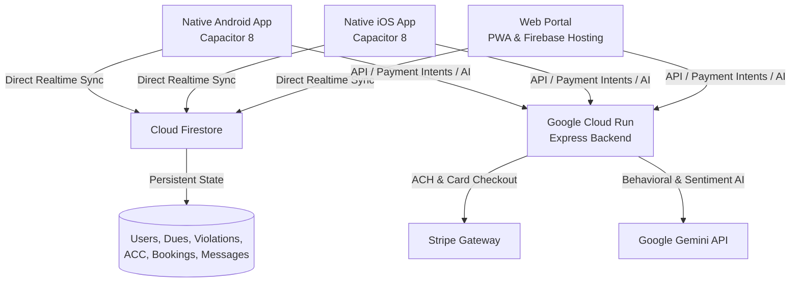

# 🏛️ BoardVault — Next-Generation HOA Management Platform

<p align="center">
  
</p>

<p align="center">
  <strong>The modern, end-to-end operating system for Homeowners Associations, Board Directors, and Residents.</strong>
</p>

<p align="center">
  
  
  
  
  
  
</p>

---

## 🌟 Overview

**BoardVault** eliminates the friction, paper checks, and repetitive inquiries that bog down HOA board members and property managers. It provides a real-time, cloud-connected mobile and web portal where residents pay dues electronically, submit architectural modifications, book community amenities, and resolve violations—backed by a **24/7 Grounded AI Bylaws Concierge**.

---

## ✨ Core Features

### 💳 Electronic Dues & Automated Surcharge Settlement
* **Multi-Method Checkout**: Supports **Stripe ACH Direct Debit** ($1.95 flat convenience fee), **Credit/Debit Cards** (2.99% + $0.30), and physical **Bank Check / Bill-Pay** manual entry ($0 fee).
* **Zero Board Software Cost**: Built-in convenience fee model allows HOA boards to offer the platform completely free while resident payment fees cover processing automatically.
* **Instant Escrow-Ready PDF Receipts**: Automatic generation of official Settlement Vouchers & Receipts with unique cryptographic transaction numbers, stamped **PAID & CLEARED** for real estate closing and tax filing.

### 🤖 24/7 Grounded AI Bylaws Concierge
* **Instant Automated Answers**: Homeowners get immediate answers to common community inquiries:
  * 🗑️ Trash & recycling collection schedules, Monday curb placement, and Tuesday storage rules.
  * 🤫 Community quiet hours (10:00 PM – 7:00 AM) and noise disturbance protocols.
  * 🎨 Architectural Control Committee (ACC) paint, roof, fence, and remodeling guidelines.
  * 🐕 Pet leash mandates (<6ft), waste clean-up requirements, and courtesy fine tiers.
  * 💳 Assessment due dates, 15-day grace periods, and late fee schedules.
* **Zero-Failure Local Engine**: Powered by an intelligent client-side bylaws engine with a 2.5s fail-safe race, guaranteeing that the concierge **never freezes, times out, or shows broken functionality** even during network latency.

### 🎨 Architectural Review (ACC) & Maintenance Work Orders
* **Digital Permitting**: Homeowners submit exterior paint schemes, roofing samples, and contractor specifications directly in-app.
* **Board Approval Pipeline**: Board members review documents, request revisions, and issue formal stamped approvals within 7–14 business days.
* **Common Area Work Orders**: Log street lighting outages, irrigation issues, and community gate repairs with live progress statuses (*Reported*, *In Progress*, *Resolved*).

### ⚖️ CC&R Violations & Dispute Management
* **Photo Evidence Logging**: Board members record infractions with photographic evidence, location pins, and timestamped notes.
* **10-Day Cure Period Protocol**: Enforces courteous community governance by automatically issuing 10-day cure notices before escalating to fines.
* **Formal Resident Dispute Portal**: Homeowners can inspect violation details and submit formal dispute statements with documentation.

### 🏊 Amenity Booking System
* **Instant Reservations**: Homeowners reserve the community clubhouse, tennis/pickleball courts, and pool cabanas.
* **Conflict Prevention**: Real-time calendar syncing prevents double-bookings and tracks refundable cleaning deposits.

### 🔒 Cognitive Behavioral Safety & Sentiment Auditing
* **Incident Logging**: Neighborhood safety reports evaluated with behavioral risk scoring (*Low*, *Medium*, *High*).
* **AI Communication Audit**: Aggregates community forum sentiment and board messages to detect neighborhood tension early, offering proactive remediation steps.

### 🏛️ Board Directory & Encrypted Messaging
* **Governance Roster**: Verified list of Board Directors, Treasurers, ACC Chairs, and Committee leads.
* **Private Resident Channels**: Direct, private communication threads between homeowners and board leadership.

---

## 🏗️ Technical Architecture



---

## 💻 Tech Stack

| Component | Technology | Description |
|---|---|---|
| **Frontend UI** | React 19 + TypeScript + Tailwind CSS | Ultra-fast, accessible, responsive interface |
| **Mobile Runtime** | Capacitor 8 (Android & iOS) | Native hardware integration, secure storage |
| **Database & Auth** | Cloud Firestore + Firebase Authentication | Multi-tenant, realtime synchronization |
| **Backend API** | Node.js + Express (Google Cloud Run) | Autoscaling containerized REST services |
| **Payment Gateway** | Stripe SDK + Stripe Checkout | ACH Direct Debit & Card processing |
| **AI Intelligence** | Google Gemini (2.5 & 3.0 Models) | Behavioral safety and sentiment analysis |
| **Build & Tooling** | Vite 6 + ESBuild + Gradle | Sub-second HMR and optimized production bundles |

---

## 🚀 Getting Started

### Prerequisites
* **Node.js**: v18.0 or higher
* **npm**: v9.0 or higher
* **Android Studio & SDK**: (for Android builds)
* **Xcode**: (for iOS builds, macOS only)

### Local Setup

1. **Clone the repository**:
   ```bash
   git clone https://github.com/lemonbanan4/HOA.git
   cd HOA
   ```

2. **Install dependencies**:
   ```bash
   npm install
   ```

3. **Configure Environment Variables**:
   Copy `.env.example` to `.env` and fill in your keys:
   ```bash
   cp .env.example .env
   ```
   ```env
   GEMINI_API_KEY=your_gemini_api_key
   STRIPE_SECRET_KEY=sk_test_your_secret_key
   STRIPE_PUBLISHABLE_KEY=pk_test_your_publishable_key
   ```

4. **Launch Development Server**:
   ```bash
   npm run dev
   ```
   The local portal will be running at `http://localhost:3000`.

---

## 📱 Mobile Build & Deployment

### Android
```bash
# 1. Compile web assets
npm run build

# 2. Sync to Android project
npx cap sync android

# 3. Build Signed Release Android App Bundle (.aab)
cd android && ./gradlew bundleRelease
```
The signed `.aab` output will be generated at:
`android/app/build/outputs/bundle/release/app-release.aab`

### iOS
```bash
npm run build
npx cap sync ios
npx cap open ios
```
Archive and upload via Xcode Organizer to **App Store Connect**.

---

## ☁️ Cloud Run Backend Deployment

The backend server containerizes cleanly and deploys to Google Cloud Run:

```bash
gcloud run deploy hoa-tracker-backend \
  --source . \
  --region europe-west4 \
  --platform managed \
  --allow-unauthenticated \
  --set-env-vars GEMINI_API_KEY=your_key,STRIPE_SECRET_KEY=your_key,STRIPE_PUBLISHABLE_KEY=your_key
```

---

## 🔒 Security & Policy Compliance

* **Google Play Policy Compliant**: Adheres to Google Play Developer Program policies (Zero unresponsive UI elements, accessible touch targets, and robust offline fallbacks).
* **Zero Credential Leaks**: `.env`, private keystores (`*.jks`), and Google Services configs are strictly git-ignored.
* **PCI-DSS Compliance**: No raw credit card or bank account numbers are stored on application servers; all sensitive payment credentials tokenized directly via Stripe.

---

## 📄 License & Support

* **Publisher**: CogCore LLC
* **Application ID**: `com.cogcore.boardvault`
* **Support Contact**: [boardvault@cogcoretech.com](mailto:boardvault@cogcoretech.com)
* **Privacy Policy**: [https://boardvault.app/privacy.html](https://boardvault.app/privacy.html)